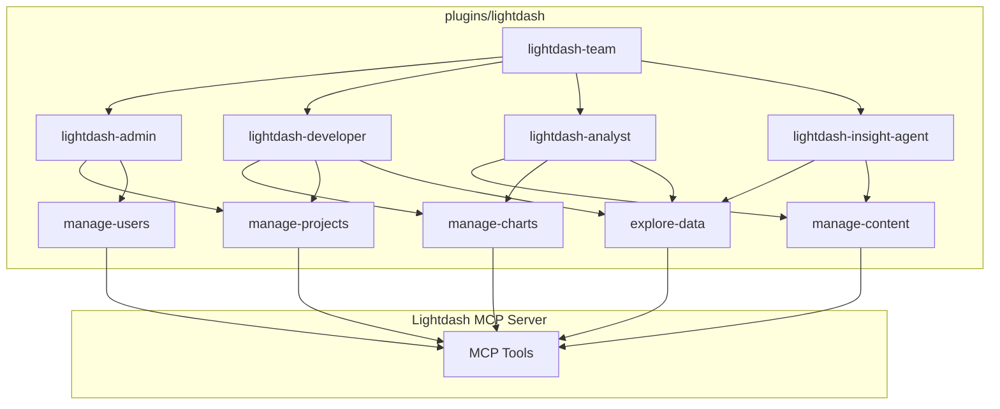

# 3. Implement Lightdash Plugin Architecture

Date: 2026-02-13

## Status

Superseded by [4. Split Lightdash Plugin Architecture](0004-split-lightdash-plugin-architecture.md)

## Context

We need to integrate Lightdash capabilities into Claude Code to allow users to interact with their BI platform directly from the IDE. The integration must support multiple distinct user roles (Admin, Developer, Analyst, Insight) and enforce strict safety modes (`read-only`, `write-idempotent`) to prevent accidental data loss or unauthorized changes. Destructive write operations are strictly disallowed within the plugin to ensure a safe-by-default experience.

## Decision

We will implement a single Claude Code plugin located at `plugins/lightdash` that provides:

1. **Strict Security Posture**:
   - The plugin strictly disallows tools requiring `write-destructive` permissions (e.g., `delete_member`, `upsert_chart_as_code`).
   - Multi-layered security is implemented via environment variables, skill definitions, and pre-tool-use hooks.
2. **Safety Modes**: Enforcement of `LIGHTDASH_TOOL_SAFETY_MODE` (defaulting to `read-only`).
3. **Atomic Skills**:
   - `manage-projects`: Project configuration and validation (Read-only).
   - `manage-users`: User and group discovery (Read-only).
   - `explore-data`: Semantic layer exploration (Read-only).
   - `manage-content`: Dashboard and space organization (Read-only).
   - `manage-charts`: Chart discovery and metadata (Read-only).
4. **Role-Based Subagents**: All subagents now operate with a `read-only` or `write-idempotent` (if applicable) profile.
5. **Agent Team**: Orchestration for intent routing and security enforcement.
   - `lightdash-insight-agent`: `read-only` profile for data investigation.
6. **Agent Team**: Orchestration for intent routing and safety enforcement.

### Architecture Diagram

## Consequences

- **Positive**:
  - Granular safety control via `LIGHTDASH_TOOL_SAFETY_MODE`.
  - Specialized agents for different user personas.
  - Centralized logic for interacting with Lightdash tools.
- **Negative**:
  - Complexity in managing safety mode propagation.
  - Need to maintain multiple subagent prompts.
