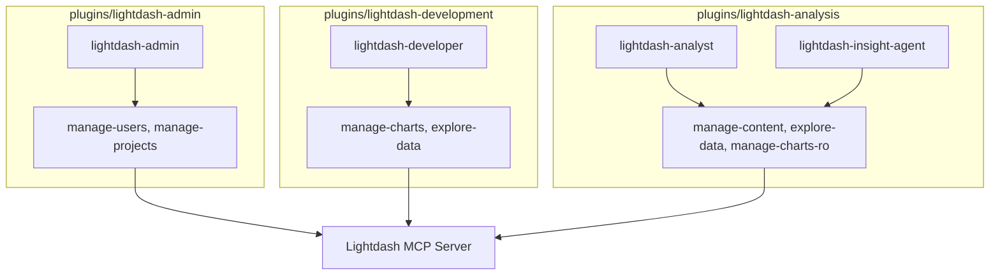

# 4. Split Lightdash Plugin Architecture

Date: 2026-02-13

## Status

Proposed

Supersedes [3. Implement Lightdash Plugin Architecture](0003-implement-lightdash-plugin-architecture.md)

## Context

The previous monolithic architecture for the Lightdash plugin ([ADR 0003](0003-implement-lightdash-plugin-architecture.md)) attempted to manage multiple roles and safety levels within a single plugin. However, for better security isolation and maintainability, we have decided to split the plugin into three distinct, specialized plugins. This allows users to install only the necessary capabilities and provides a stronger "safe-by-default" guarantee by completely removing destructive tools from the analysis-focused plugin.

## Decision

We will split the `plugins/lightdash` plugin into three isolated plugins:

1. **`lightdash-admin`**:
   - **Scope**: Governance, user/group management, and project validation.
   - **Safety**: Supports `write-destructive` for tools like `delete_member`.
2. **`lightdash-development`**:
   - **Scope**: Analytics engineering, "charts-as-code", and dbt integration.
   - **Safety**: Supports `write-destructive` for `upsert_chart_as_code`.
3. **`lightdash-analysis`**:
   - **Scope**: Data exploration, search, and insight generation.
   - **Safety**: **Strictly Read-Only**. Destructive tools are entirely omitted from this plugin.

### Refactored Architecture Diagram

## Consequences

- **Positive**:
  - **Strong Isolation**: Installation-level security prevents accidental execution of destructive tools in analysis contexts.
  - **Reduced Complexity**: Each plugin has a focused system prompt and a smaller set of tools.
  - **Clearer Persona Mapping**: Users can be granted access to specific plugins based on their organizational role.
- **Negative**:
  - **Duplication**: Some skills (like `explore-data`) may be shared or duplicated across plugins.
  - **Maintenance**: Managing three separate manifests and READMEs.
