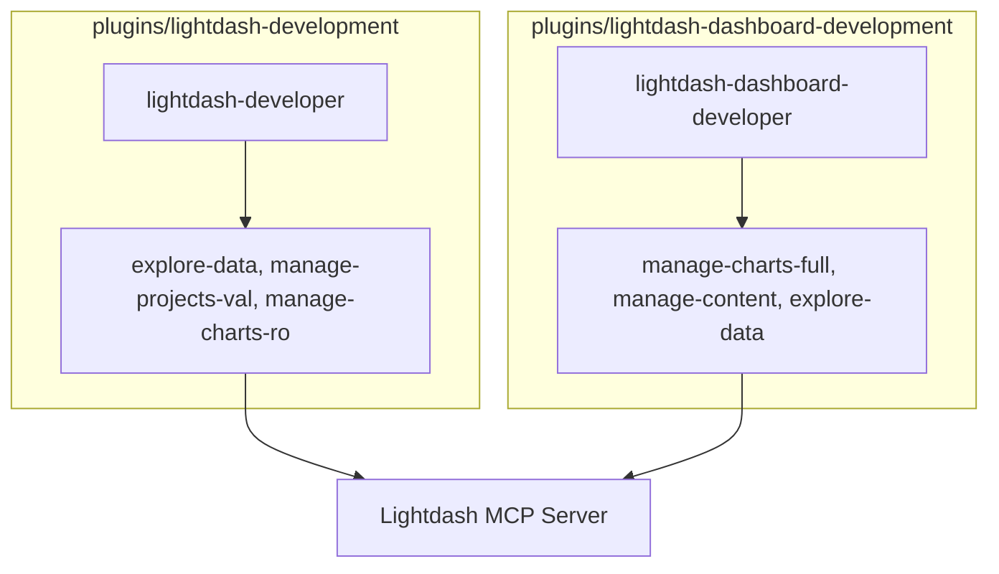

# 5. Split Dashboard Development from Semantic Layer Development

Date: 2026-02-13

## Status

Proposed

Amends [4. Split Lightdash Plugin Architecture](0004-split-lightdash-plugin-architecture.md)

## Context

We have successfully split Lightdash functionality into `admin`, `analysis`, and `development`. However, the `development` plugin currently covers both the semantic layer (dbt YAML, metrics, dimensions) and the visualization layer (charts and dashboards). These two tasks often require different focuses and safety levels. Semantic layer development is logic-heavy and focuses on project validation, while dashboard development is visualization-heavy and requires write access to charts.

## Decision

We will further split `lightdash-development` into two specialized plugins:

1.  **`lightdash-development` (Renamed/Refocused)**:
    - **Scope**: Semantic Layer development (dbt YAML, metrics, dimensions).
    - **Safety**: **Read-Only** (for MCP). Focuses on `validate_project` and `explore-data`.
    - **Key Skills**: `explore-data`, `manage-projects` (Validation), `manage-charts` (Read-only).
2.  **`lightdash-dashboard-development` (New)**:
    - **Scope**: Visualization Layer development (Charts, Dashboards, Spaces).
    - **Safety**: **Write-Destructive**. Allows `upsert_chart_as_code`.
    - **Key Skills**: `manage-charts` (Full), `manage-content`, `explore-data` (Read-only).

### Architecture Diagram

## Consequences

- **Positive**:
  - **Role Clarity**: Developers can focus on either data modeling or visualization.
  - **Security**: YAML development can remain read-only for remote assets, while visualization development is granted write access specifically for charts.
  - **Maintainability**: Separate system prompts tailored to each developer persona.
- **Negative**:
  - **Overhead**: An additional plugin to maintain and install.
  - **Duplication**: `explore-data` is now shared across almost all plugins.
