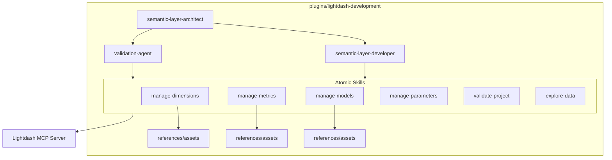

# 6. Rearchitect Lightdash Development Plugin

Date: 2026-02-13

## Status

Proposed

## Context

The `lightdash-development` plugin currently has overlapping responsibilities with the visualization layer and lacks atomic skill definitions. The official Lightdash agent skills already handle chart and dashboard development. We need to focus this plugin on the **Semantic Layer** (dbt modeling, metrics, dimensions) and adopt dbt 1.10+ and Fusion standards.

## Decision

We will rearchitect the `lightdash-development` plugin with the following changes:

1. **Narrow Scope**: Focus exclusively on Semantic Layer development.
2. **Atomic Skills**: Replace monolithic skills with atomic units: `manage-dimensions`, `manage-metrics`, `manage-models`, `manage-parameters`, and `validate-project`.
3. **Reference-Rich Structure**: Each skill will have its own `references/` and `assets/` to provide deep context to the agent.
4. **Agent Teams**: Implement a lead `semantic-layer-architect` and specialized sub-agents (`semantic-layer-developer`, `validation-agent`).
5. **Modern Standards**: Target dbt 1.10+ and dbt Fusion syntax exclusively.
6. **Progressive Disclosure**: Separate documentation into `basics.md` and `advanced.md` to help agents start simple.

### Refactored Architecture Diagram

## Consequences

- **Positive**:
  - **Focused Agent Intelligence**: Agents will have more precise instructions and smaller toolsets.
  - **Better Scaling**: New semantic layer features can be added as atomic skills.
  - **Alignment with Official Skills**: No duplication of visualization work.
- **Negative**:
  - **Increased Management Overhead**: More files and directories to maintain.
