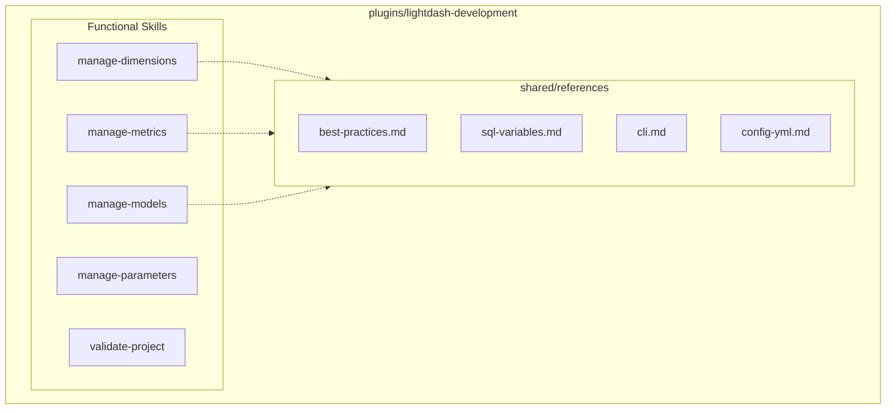

# 8. Consolidate Shared References in Lightdash Development Plugin

Date: 2026-02-13

## Status

Proposed

## Context

The `lightdash-development` plugin was recently rearchitected to focus on the semantic layer. As part of this, several "knowledge-only" skills were created (e.g., `best-practices`, `sql-variables`, `lightdash-cli`, `lightdash-config-yml`). While these provide valuable context to agents, they are not functional tools or actions. Having them as top-level skills adds noise to the agent's skill selection and complicates the mental model of the plugin.

## Decision

We will consolidate these static reference materials into a centralized `shared/references` directory within the `lightdash-development` plugin.

1.  **Centralize Knowledge**: Move the content of "knowledge skills" to `skills/shared/references/`.
2.  **De-clutter Skills**: Remove the skill folders for `best-practices`, `sql-variables`, `lightdash-cli`, and `lightdash-config-yml`.
3.  **Explicit Cross-Referencing**: Functional skills (like `manage-dimensions`) will explicitly reference these shared files in their own `SKILL.md` or as part of the agent's context.

### Refactored Structure

## Consequences

- **Positive**:
  - **Cleaner Skill Interface**: The list of available skills for the agent is now focused on actions.
  - **Reduced Redundancy**: Shared concepts are maintained in one place.
  - **Simplified Plugin Management**: Fewer `SKILL.md` files to update and maintain.
- **Negative**:
  - **Indirect Reference**: Agents must be taught (via rules or `SKILL.md`) to look at the shared references if they need deep background context.
