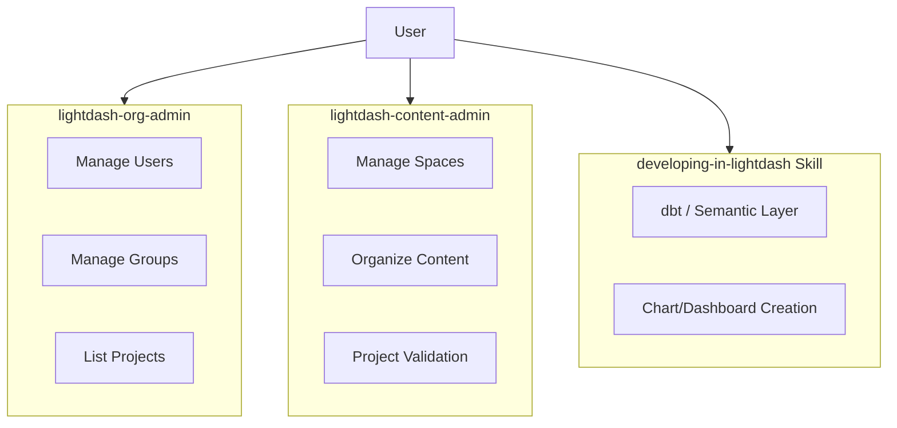

# 9. Refactor Lightdash Plugins for Better Focus

Date: 2026-02-13

## Status

Accepted

## Context

The current Lightdash plugin structure has overlapping responsibilities with the official `developing-in-lightdash` skill. Specifically:

- `lightdash-admin` handles both organization-level and project-level administration.
- `lightdash-dashboard-development` focuses on creating charts and dashboards, which is now largely covered by the official `developing-in-lightdash` skill.

To improve clarity and reduce cognitive load for AI agents, we need a cleaner separation of concerns between organization management, project content management, and core development.

## Decision

We will refactor the plugin architecture as follows:

1.  **Rename `lightdash-admin` to `lightdash-org-admin`**:
    - This plugin will strictly focus on organization-level entities: Users, Groups, Projects (listing/metadata), and Organization Settings.
2.  **Rename `lightdash-dashboard-development` to `lightdash-content-admin`**:
    - This plugin will focus on the administrative lifecycle of content _within_ a project: Space management, content search, moving assets between spaces, and project-level validation.
    - We will remove core "development" logic (like building charts from YAML) that duplicates the official `developing-in-lightdash` skill.

### Architecture Diagram

## Consequences

- **Clearer Scope**: Each plugin has a well-defined domain, making it easier for agents to choose the right tool.
- **Reduced Redundancy**: We leverage official skills for development instead of maintaining parallel implementations.
- **Breaking Changes**: External references to these plugin names or paths will need to be updated.
