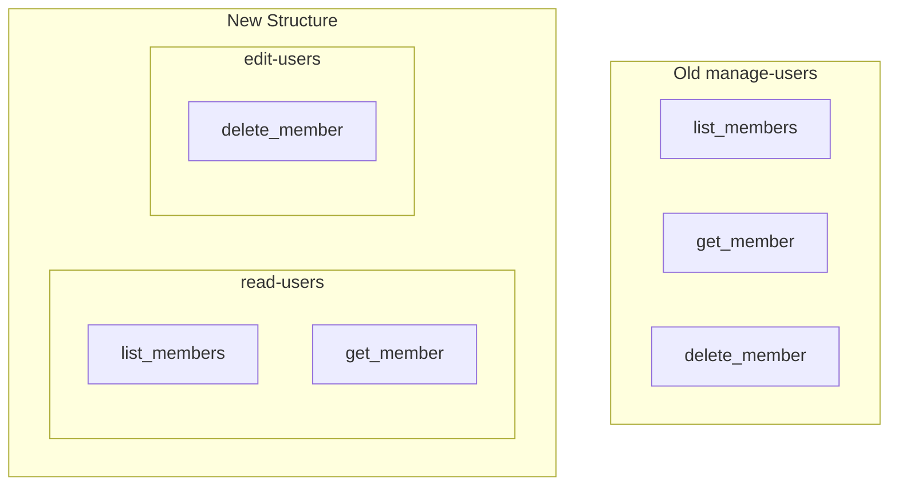

# 11. Separate Read and Edit Skills Across Plugins

Date: 2026-02-13

## Status

Accepted

## Context

Administrative and development skills across all plugins (e.g., `lightdash-org-admin`, `lightdash-content-admin`, `lightdash-development`) frequently have skills named with the `manage-` prefix (e.g., `manage-users`, `manage-dimensions`). These skills often bundle both read-only operations (list, get) and state-changing operations (create, update, delete).

Bundling these operations makes it difficult to enforce the principle of least privilege. For example, an agent might only need to list dimensions to provide context, but having a `manage-dimensions` skill might imply it can also modify them. Even when tools are limited to read-only, the `manage-` prefix is ambiguous.

By separating read and edit operations into distinct skills across the entire project, we can:

1. Improve safety by explicitly granting only the necessary capabilities.
2. Reduce cognitive load for agents by providing more focused skill definitions.
3. Standardize skill naming conventions across all plugins.
4. Make it easier to audit agent capabilities.

## Decision

We will refactor all skills starting with `manage-` to follow a `read-` or `edit-` naming convention across all plugins:

1. **Split or Rename `manage-<resource>` skills**: Each existing `manage-` skill will be refactored into:
   - `read-<resource>`: Contains only read-only tools (e.g., `list_...`, `get_...`).
   - `edit-<resource>`: Contains state-changing tools (e.g., `create_...`, `update_...`, `delete_...`).
   - Note: If a skill currently only contains read-only tools, it will be renamed to `read-`. If it only contains write/destructive tools, it will be renamed to `edit-`.
2. **Naming Convention**:
   - `read-<resource>` for read-only access.
   - `edit-<resource>` for modification, deletion, or environment management access.
3. **Cross-Plugin Implementation**: This applies to `lightdash-org-admin`, `lightdash-content-admin`, `lightdash-development`, and `lightdash-analysis`.
4. **Shared References**: If both skills need the same reference documentation, we will keep it in a shared directory or duplicate as necessary for clarity.

### Skill Separation Example (Users)

## Consequences

- **Safety**: Agents can be assigned `read-users` without any risk of accidentally triggering a deletion, even if safety modes are misconfigured.
- **Clarity**: The intent of a skill is immediately clear from its name.
- **Granularity**: Provides finer-grained control over agent capabilities.
- **Migration**: Existing agents using `manage-` skills will need to be updated to use the new specialized skills.
