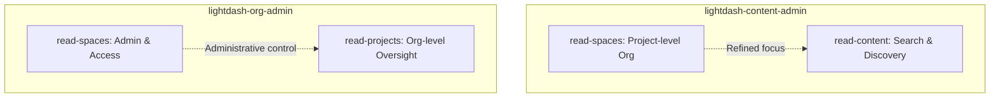

# 12. Refactor Space Management Skills to Read/Edit Convention

Date: 2026-02-13

## Status

Accepted

## Context

Existing `manage-content` skill in `lightdash-content-admin` includes basic space discovery (`list_spaces`, `get_space`). However, space management is a distinct administrative domain that will soon include CRUD operations (`create_space`, `update_space`, `delete_space`) and access control (which is an organization-level administrative task).

The `lightdash-org-admin` plugin currently lacks space management capabilities entirely, even though organization admins often need to oversee or manage spaces across projects, particularly regarding access control.

To maintain a clean separation of concerns and prepare for these new management and access control capabilities, we need dedicated `manage-spaces` skills in both plugins, tailored to their respective administrative levels.

## Decision

We will implement dedicated `manage-spaces` skills as follows:

1. **`lightdash-content-admin/read-spaces`**:
   - Focused on project-level space organization.
   - Includes tools for listing and inspecting spaces.
   - Future extension: Project-level CRUD (create/update/delete spaces) will be in `edit-spaces`.
   - Scope: Organization of content _within_ the project.

2. **`lightdash-org-admin/read-spaces`**:
   - Focused on organization-level space administration.
   - Includes tools for listing and inspecting spaces.
   - Future extension: Space access management and organization-wide oversight.
   - Scope: Administrative control and access governance.

3. **Coexistence**:
   - In `lightdash-content-admin`, the `read-spaces` skill will coexist with `read-content` to provide specialized management capabilities while `read-content` continues to provide broad discovery.

### Architecture Diagram

## Consequences

- **Separation of Concerns**: Space lifecycle management is decoupled from general content search and discovery.
- **Extensibility**: Provides a clear location for adding future space CRUD and access control tools.
- **Role Consistency**: Org admins and Content admins have dedicated space management interfaces appropriate to their permissions and responsibilities.
- **Redundancy (Intentional)**: Basic viewing tools (`list_spaces`, `get_space`) will be present in both, reflecting that both roles need visibility into space structures.
