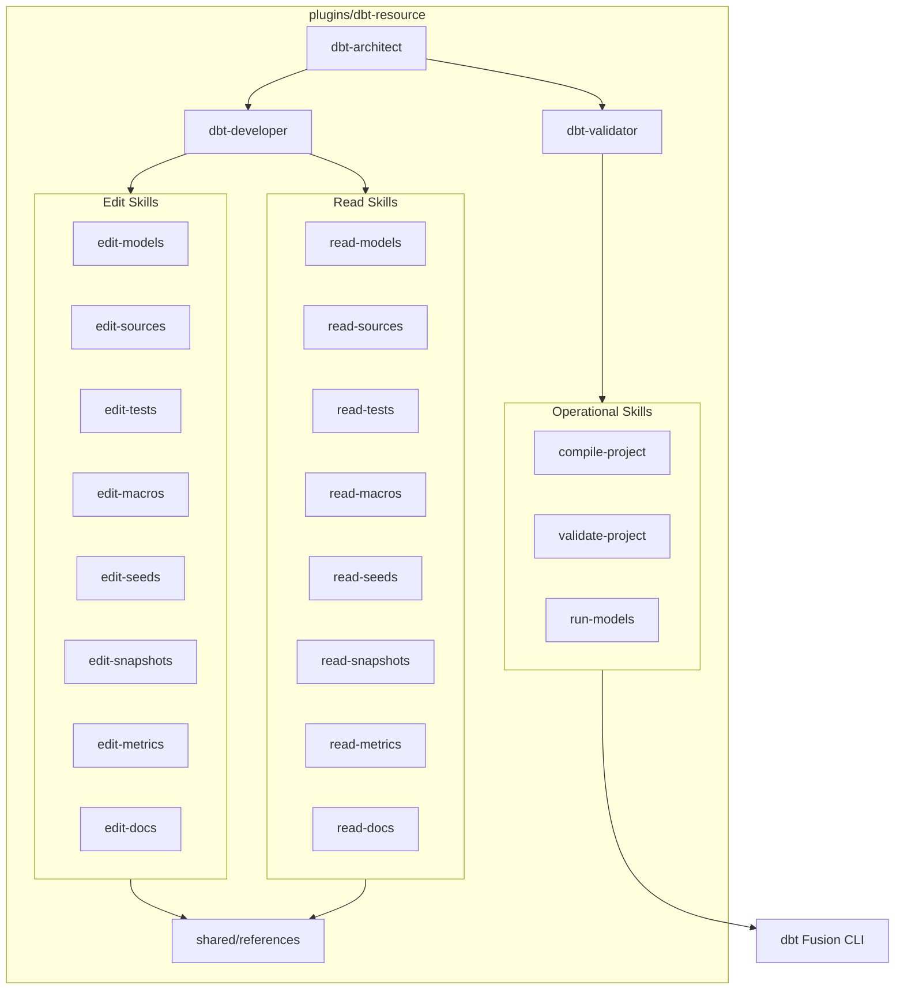

# 13. Implement dbt Resource Plugin for dbt Fusion Development

Date: 2026-02-13

## Status

Proposed

## Context

The project currently provides Lightdash plugins for semantic layer modeling, analysis, and administration. However, there is no dedicated plugin for core dbt resource development — the foundational workflow that every analytics engineer performs daily.

dbt projects consist of multiple resource types (models, sources, tests, macros, seeds, snapshots, metrics/semantic models, exposures, and documentation). Developing these resources involves SQL authoring, YAML configuration, Jinja templating, and CLI-driven compilation, testing, and validation.

dbt Fusion is the next-generation execution engine (written in Rust) that provides faster compilation, SQL comprehension, and a Language Server Protocol (LSP). It is the recommended CLI for modern dbt development.

Key requirements:

- Atomic skills for each dbt resource type (models, sources, tests, macros, seeds, snapshots, metrics, exposures, docs).
- Read/edit separation following ADR 0011 for least-privilege enforcement.
- Sub-agents that compose atomic skills for specific workflows.
- Agent teams that coordinate sub-agents for complex development tasks.
- dbt Fusion CLI as the primary execution engine.
- Progressive disclosure with `references/basics.md` and `references/advanced.md` per skill.
- Shared references for cross-cutting concerns (project structure, CLI commands, Jinja patterns, naming conventions).

## Decision

We will implement a `dbt-resource` plugin with the following architecture:

### 1. Atomic Skills (read-* / edit-*)

Following ADR 0011, each dbt resource type gets separate read and edit skills:

| Resource | Read Skill | Edit Skill |
|---|---|---|
| Models | `read-models` | `edit-models` |
| Sources | `read-sources` | `edit-sources` |
| Tests | `read-tests` | `edit-tests` |
| Macros | `read-macros` | `edit-macros` |
| Seeds | `read-seeds` | `edit-seeds` |
| Snapshots | `read-snapshots` | `edit-snapshots` |
| Metrics | `read-metrics` | `edit-metrics` |
| Documentation | `read-docs` | `edit-docs` |

### 2. Operational Skills

| Skill | Purpose |
|---|---|
| `compile-project` | Run `dbt compile` to validate SQL and YAML |
| `validate-project` | Run `dbt test` and validation checks |
| `run-models` | Run `dbt run` / `dbt build` for materialization |

### 3. Sub-Agents

| Agent | Role | Skills |
|---|---|---|
| `dbt-architect` | Lead agent — designs data model structure, enforces standards, delegates | All read-* skills |
| `dbt-developer` | Implementation specialist — creates and modifies dbt resources | All read-* and edit-* skills |
| `dbt-validator` | QA specialist — compiles, tests, validates | compile-project, validate-project, run-models |

### 4. Shared References

| Reference | Content |
|---|---|
| `project-structure.md` | dbt project layout and directory conventions |
| `dbt-fusion-cli.md` | dbt Fusion CLI commands and flags |
| `jinja-patterns.md` | Common Jinja2 patterns for dbt |
| `naming-conventions.md` | Resource naming standards |

### Architecture Diagram

## Consequences

### Positive

- **Comprehensive Coverage**: All dbt resource types have dedicated skills with domain-specific knowledge.
- **Atomic Granularity**: Each skill focuses on a single resource type, enabling precise delegation.
- **Read/Write Separation**: Follows ADR 0011 for least-privilege enforcement.
- **Progressive Disclosure**: basics.md and advanced.md references prevent information overload.
- **dbt Fusion Native**: Skills target dbt Fusion CLI and modern dbt standards.
- **Composable Architecture**: Sub-agents compose skills; teams coordinate sub-agents.

### Negative

- **File Count**: Many skill directories and reference files to maintain.
- **No MCP Server**: Unlike Lightdash plugins, this plugin uses CLI tools rather than API-based MCP tools.

### Risks

- **dbt Fusion API Changes**: dbt Fusion is evolving rapidly; CLI flags and behaviors may change.
- **Version Compatibility**: Skills target modern dbt (1.9+/Fusion); legacy projects may need adaptation.

### Mitigation

- Pin documentation to specific dbt versions in references.
- Use shared references for CLI commands so updates propagate to all skills.
- Monitor dbt Fusion changelog for breaking changes.
